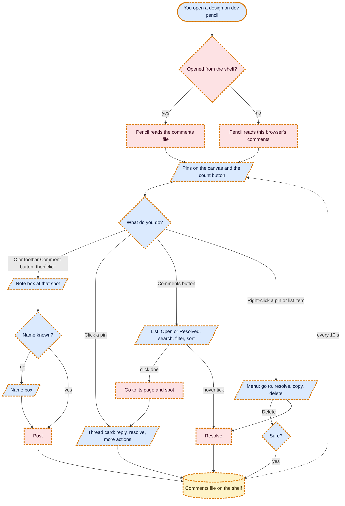
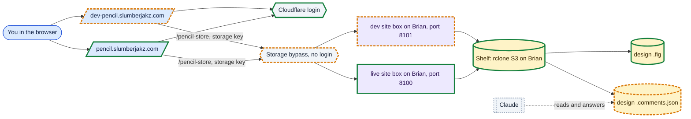
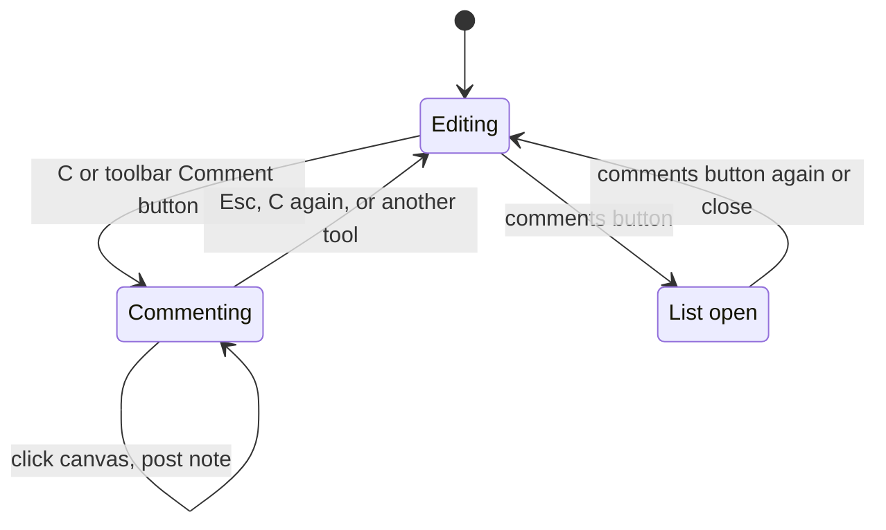
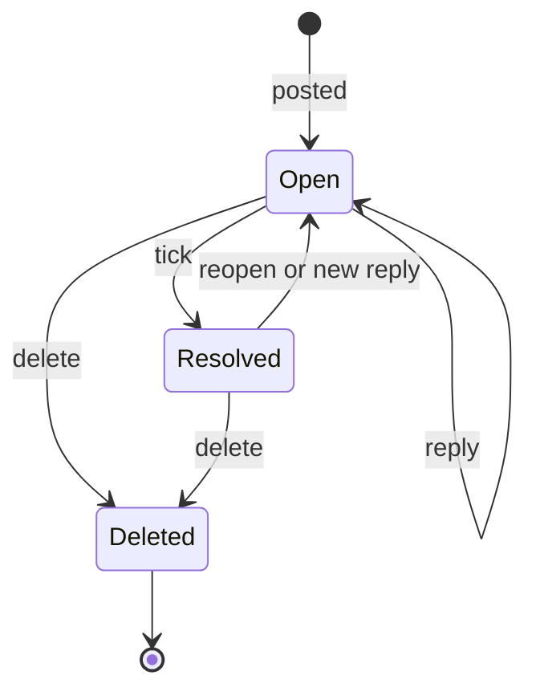
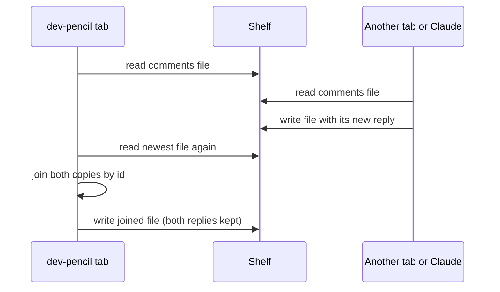

# Comments in Pencil

Requested by Niraj, 2026-10-08. Lives on the `slumberjakz` branch of this fork and runs at
https://dev-pencil.slumberjakz.com. Live pencil (https://pencil.slumberjakz.com) stays on stock OpenPencil
v0.15.1 until Niraj says "promote".

## What it is

Leave notes on a design, like sticky notes with a conversation attached. The flow follows Figma and Notion
(round 2, from Niraj's canvas feedback, 2026-10-08):

- **Comment tool.** Press **C**, or the speech-bubble-plus button at the end of the bottom toolbar, then click
  anywhere and type. Enter posts. Esc, or picking any other tool (V, R, T…), leaves comment mode.
- **Pins follow the layer.** A pin dropped on a frame stays on that frame when the frame moves. If the frame is
  deleted, the pin stays where it was.
- **Thread card.** Click a pin to open its thread: reply, resolve (tick), or **More actions** (copy text, delete).
- **Comments list.** The comments button at the top right (with the open count) only opens and closes the list; it
  never starts a new comment. In the list:
  - **Open / Resolved** tabs, each with its count.
  - **Search** across comment text, replies, names and layer names.
  - **Filter and sort**: this page or all pages, only my comments, newest or oldest first.
  - Hover a comment for a quick **Resolve** tick and **More actions**; click it to jump to its page and spot.
- **Right-click** a pin or a comment in the list for the same actions: go to comment, resolve or reopen, copy text,
  delete. Right-clicking comments no longer opens the canvas layer menu underneath.
- **Resolve** hides the pin from the canvas; it shows again while the list is on the Resolved tab. A new reply
  reopens a thread. **Delete** asks first.
- **Names.** The first comment asks for a name, kept in this browser (the same name the live-collab panel uses).
- **Languages.** Every word is in OpenPencil's language files (English plus its 8 translations), so the feature can
  be offered to OpenPencil's makers.

## Where comments are saved

Comments never go inside the `.fig` file, so the design file stays exactly what stock OpenPencil (and live pencil)
reads. They sit next to it on the shelf as a plain text file:

```
designs/pencil-store/open_pencil_storage/canvases/<id>.fig            the design (unchanged)
designs/pencil-store/open_pencil_storage/canvases/<id>.comments.json  its comments
```

- Designs opened from the shelf: comments go to the shelf, so they show on any browser and computer, and Claude can
  read and answer them by reading and writing that JSON file.
- Designs opened from your computer (not the shelf): comments stay in this browser only. The comments list says so.
- dev-pencil and live pencil use the same shelf, so the same designs open in both. Live pencil simply doesn't show
  the comments (it doesn't know about them) and its file list ignores the comments files.
- Every 10 seconds the open design checks for new comments, so a reply added somewhere else appears on its own.
- Two places saving at once don't lose anything: each save first reads the newest file and joins the two, matching
  threads and replies by id. For a thread changed in both places, the newer change wins and all replies stay.
- Deleting is a soft delete (marked deleted in the file), so a slower save elsewhere can't bring it back.

## Not in this version

- Mentions and email alerts.
- Comments on designs that live only on your computer appearing anywhere else.
- Removing the comments file when a design is deleted from the shelf (it stays as a small orphan file).
- Mentions inside comments (@name).
- Unread markers per person.

## Flow charts

### You leaving and answering comments



### Where the parts run



### Comment mode and the list



### A comment thread's states



### Two saves at the same time



## Analytics

None. An internal tool for Niraj, like InfiniBoard.

## Shared and game parts

Shared tooling; no game code.

## Undo

dev-pencil is a separate site. Taking it down: `docker compose down` in `/opt/data/selfhost/openpencil-dev` on
Brian, then remove its Cloudflare route, DNS record and the two Access apps (steps in that folder's `UNDO.md`).
Comments files on the shelf are plain text and harmless to live pencil; they can stay or be deleted.
