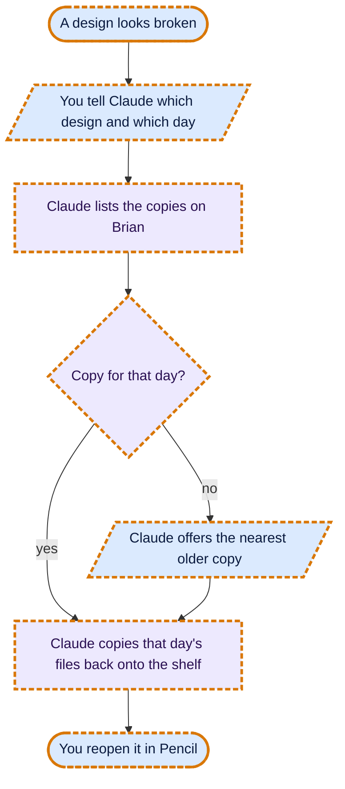
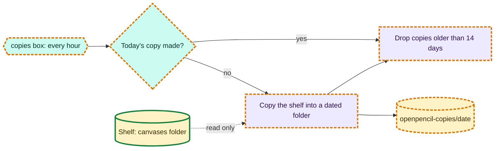

# Daily copies of the Pencil shelf

Requested by Niraj, 2026-10-08 (idea from the Game screens thread). Same idea as Moodboard's nightly copy.

## What it is

Once a day, Brian copies every design on the Pencil shelf (the `.fig`, its name file, its preview and its
comments) into a dated folder, and keeps the last 14 days. If a bad save or a broken test build damages a design,
the copy from a day before brings it back.

- Runs as a small box (`copies`) beside dev-pencil, from `deploy/dev-pencil/design-copies.sh`. It checks every
  hour and makes the day's copy the first time it runs that day (days in India time).
- It only reads the shelf (mounted read-only), so it can't change a design.
- Copies live in `/opt/data/selfhost/openpencil-copies/<date>/` on Brian.
- Restoring is by hand on Brian, one design or all: copy the files for that design id back into the shelf's
  `canvases` folder (the command is at the top of the script). Ask Claude and it does it.

## Flow charts

### You getting a design back

### The daily copy

## Analytics

None (internal tool).

## Undo

`docker compose stop copies` in `/opt/data/selfhost/openpencil-dev`; delete `/opt/data/selfhost/openpencil-copies`
when no longer wanted.
