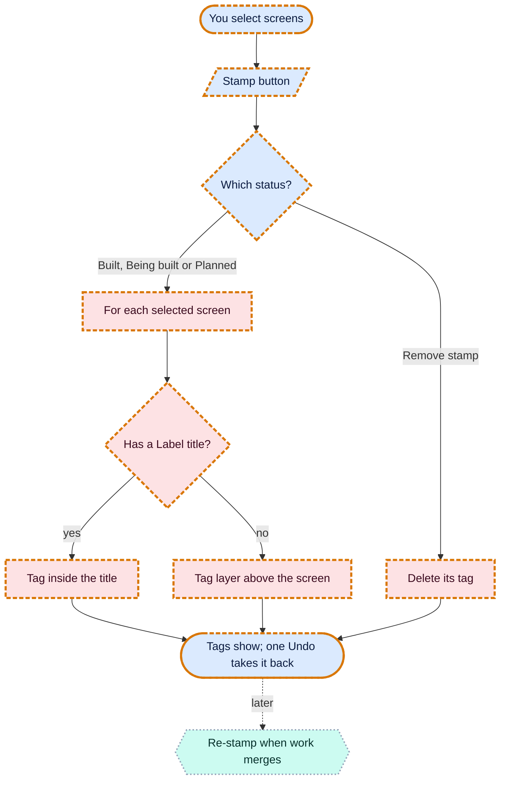
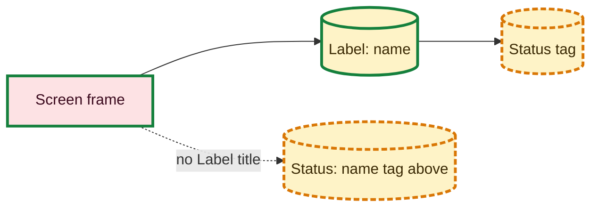

# One-click build stamps

Requested by Niraj, 2026-10-08 (idea from the Game screens thread).

## What it is

Every wireframe screen carries a small tag saying how far it is built: **Built** (green), **Being built** (amber)
or **Planned** (grey), the same colours as the project's diagrams. Until now Claude's script drew these by hand.
Now:

1. Select one or more screens (or anything inside them).
2. Press **Stamp** at the top right of the canvas and pick a status, or **Remove stamp**.

- A screen with a title above it (a layer named `Label: <screen name>`, as the wireframe script makes) gets the tag
  inside that title, exactly where the script puts it. Stamping again changes the tag in place.
- A screen with no title gets a tag layer named `Status: <screen name>` just above it.
- Titles, notes and tags themselves are never stamped.
- The whole stamp is one step: Undo takes it back.
- The menu is in all of OpenPencil's languages; the tag written into the design stays in English, because scripts
  read it back.

## Not in this version (planned)

- **Staying in sync with what's merged.** The idea is that each screen names the issue or pull request it belongs
  to, and Claude (or a nightly robot) re-stamps the screens when that work merges. That needs a link from screen to
  issue first, so it waits for the next round. Today Claude can re-stamp from the shelf file after merges.

## Flow charts

### You stamping screens

### Where the tag goes

## Analytics

None (internal tool).
